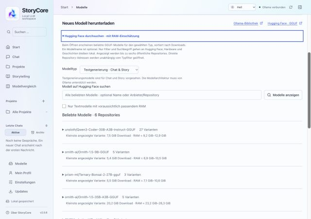
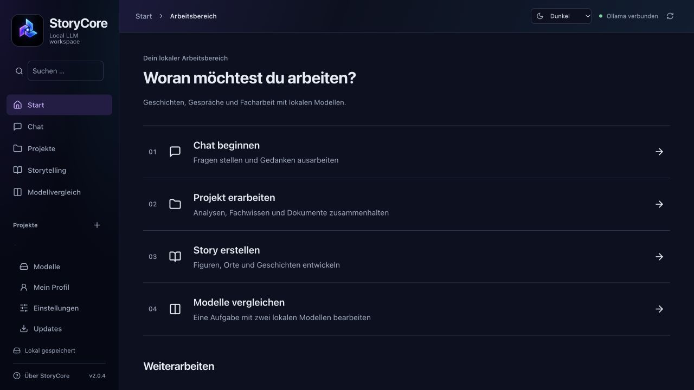

# StoryCore für macOS

Lokale Sprachmodelle mit Ollama nutzen: chatten, Geschichten entwickeln und Modelle vergleichen. Version 2.0.8 enthält Projektarbeitsbereiche mit Fachwissen, Dokumenten und einem freiwilligen persönlichen Profil.

Dieses öffentliche Repository enthält **Downloads und Dokumentation**. Der StoryCore-Quellcode bleibt privat. Die App darf kostenlos privat und geschäftlich genutzt werden. Andere Nutzer bitte auf die offiziellen Downloads verweisen; die zentrale Installation in der eigenen Organisation ist erlaubt. [Nutzungsbedingungen](LICENSE.txt).

## Aktueller Download: StoryCore 2.0.8

**[StoryCore 2.0.8 für den Mac herunterladen (Installer-ZIP)](https://github.com/YorkStack/StoryCore-Releases/releases/download/v2.0.8/StoryCore_2.0.8_Mac-Installer.zip)**

**Aktuelle reguläre Version.** Enthält die neue Oberfläche, Chat, Projekte, Storytelling, Modellvergleich und Dokumentanhänge per Drag-and-drop. Frühere 2.0.x-Stände sind damit überholt.

ZIP entpacken und **Install-StoryCore.command** doppelklicken. StoryCore.app und install-macos.sh müssen neben der Routine liegen. [Alle Downloads zu 2.0.8, einschließlich DMG und PDF-Anleitungen](https://github.com/YorkStack/StoryCore-Releases/releases/tag/v2.0.8).

| Version | Status | Verwendung |
| --- | --- | --- |
| [**2.0.8**](https://github.com/YorkStack/StoryCore-Releases/releases/tag/v2.0.8) | **Aktuell · stabil** | Hugging-Face-Katalog ohne Suchbegriff, Filter und RAM-Anzeige; Weblinks öffnen den Standardbrowser |
| [2.0.7](https://github.com/YorkStack/StoryCore-Releases/releases/tag/v2.0.7) | Ältere stabile Version | Rechte Einstellungsleiste in jedem Bereich wieder öffnen |
| [2.0.6](https://github.com/YorkStack/StoryCore-Releases/releases/tag/v2.0.6) | Ältere Beta | Updates unter /Applications mit macOS-Freigabe und reparierter Installer |
| [2.0.5](https://github.com/YorkStack/StoryCore-Releases/releases/tag/v2.0.5) | Ältere Beta | Grafischer Update-Fortschritt, Statusschritte und Fehlermeldungen |
| [2.0.4](https://github.com/YorkStack/StoryCore-Releases/releases/tag/v2.0.4) | Ältere stabile Version | Neue Oberfläche, Projekte, Dokumentanhänge und Updates |
| [**2.0.2**](https://github.com/YorkStack/StoryCore-Releases/releases/tag/v2.0.2) | **Stabile Vorgängerversion** | Erste öffentliche Version mit Updates aus diesem Download-Repository |

**Updates:** 2.0.8 ist als reguläres Release veröffentlicht und wird im normalen Kanal **Nur stabile Versionen** angeboten. In der App **Updates → Jetzt prüfen** wählen. Die Freigabe von Vorabversionen ist dafür nicht erforderlich. GitHubs **Latest** verweist auf 2.0.8. Die Versionsübersicht beginnt bei 2.0.2.

Die automatisch angebotenen „Source code“-Archive enthalten hier nur die Dokumentation und sind keine App-Installer.

**Apple Silicon (M-Serie), macOS 14 oder neuer.** Kein Node.js, Rust oder Xcode nötig. Die Routine prüft den Mac und Ollama. Falls Ollama fehlt, bietet sie den [offiziellen Download](https://ollama.com/download/mac), das Starten einer vorhandenen Installation oder eine Installation vorerst ohne Ollama an. Modelle anschließend in StoryCore herunterladen.

Die Pakete sind **nicht Apple-notarisiert**. macOS kann eine Freigabe unter Datenschutz & Sicherheit verlangen; verwaltete Macs benötigen eventuell eine IT-Freigabe. Die separate kryptografische Updatesignatur ersetzt keine Apple-Notarisierung. [Installation und Gatekeeper](docs/INSTALLATION-MAC.md).

## Paket-Downloads

Gezählt werden Downloads der Installer-ZIPs, DMGs und Update-Pakete je veröffentlichter Version. Wiederholte Downloads und Tests zählen mit; die Zahlen zeigen **keine eindeutigen Nutzer oder erfolgreichen Installationen**. PDFs, Prüfsummen, Lizenzen und Update-Abfragen sind nicht enthalten.

<!-- download-stats:start -->

| Version | Status | Installer-ZIP | DMG | Update-Paket | Gesamt |
| --- | --- | ---: | ---: | ---: | ---: |
| [2.0.8](https://github.com/YorkStack/StoryCore-Releases/releases/tag/v2.0.8) | Stabil | 1 | 0 | 1 | 2 |
| [2.0.7](https://github.com/YorkStack/StoryCore-Releases/releases/tag/v2.0.7) | Stabil | 1 | 0 | 2 | 3 |
| [2.0.6](https://github.com/YorkStack/StoryCore-Releases/releases/tag/v2.0.6) | Beta | 0 | 0 | 1 | 1 |
| [2.0.5](https://github.com/YorkStack/StoryCore-Releases/releases/tag/v2.0.5) | Beta | 0 | 0 | 1 | 1 |
| [2.0.4](https://github.com/YorkStack/StoryCore-Releases/releases/tag/v2.0.4) | Stabil | 0 | 0 | 2 | 2 |
| [2.0.2](https://github.com/YorkStack/StoryCore-Releases/releases/tag/v2.0.2) | Stabil | 1 | 0 | 1 | 2 |

Datenstand (zuletzt geändert): 08.10.2026 12:12 UTC.

<!-- download-stats:end -->

Automatische Prüfung täglich gegen **05:37 UTC**, nach Veröffentlichung/Änderung eines Releases und bei Änderungen an dieser README. GitHub kann geplante Läufe verzögern. Unveränderte Zahlen erzeugen keinen neuen Commit; der Datenstand bleibt dann erhalten. [Letzte Prüfung oder manuell starten: Actions → Download statistics → Run workflow](https://github.com/YorkStack/StoryCore-Releases/actions/workflows/download-stats.yml). [Technik und Wartung](docs/DOWNLOAD-STATISTIK.md).

## Neu in 2.0.8

**Modelle ohne Namenseingabe entdecken:** Beim Öffnen von „Hugging Face durchsuchen“ erscheinen beliebte GGUF-Modelle passend zum Modelltyp. Der Typwechsel lädt die Liste automatisch neu. Dateigrößen und geschätzter RAM-Bedarf helfen bei der Auswahl; der RAM-Filter bleibt optional. Eine Variante auswählen und erst danach bewusst herunterladen.

**Weblinks funktionieren in der Mac-App:** Download-Repository, Modellseiten und andere externe HTTP(S)-Links öffnen den Standardbrowser.

Das Symbol für die rechte Einstellungsleiste bleibt oben rechts in allen Bereichen sichtbar, auch bei Projekten. Nach dem Einklappen oder Schließen über X lässt sie sich dort wieder öffnen; deine Auswahl bleibt beim Bereichswechsel erhalten.

[Installer herunterladen](https://github.com/YorkStack/StoryCore-Releases/releases/tag/v2.0.8). **2.0.8 ist stabil und Latest.** Die Version unterstützt Updates am bisherigen Ort unter `/Applications`: Bei fehlenden Rechten fragt macOS nach Administrator-Zugangsdaten. StoryCore speichert diese nicht. Der App-Austausch wird vorbereitet und geprüft, bei Fehlern wird die bisherige App zurückgestellt. Kein dauerhafter Administrator-Dienst; Nutzerdaten bleiben erhalten.

**Bereits blockierte alte Version?** Die alte Schreibprüfung kann den neuen Fix nicht selbst laden. Einmal den Installer aus 2.0.8 ausführen; die App bleibt unter `/Applications`. `StoryCore.app` und `install-macos.sh` müssen neben `Install-StoryCore.command` bleiben. Danach steht dieser Weg im integrierten Updater bereit. [Ablauf und Grenzen](docs/UPDATES.md#updates-unter-applications-ab-206-beta).

**Teststand:** Austausch und Fehler-Rücksetzung wurden mit Test-Apps geprüft; der echte Systemdialog mit interaktiver Administratorfreigabe und anschließendem Neustart wurde noch nicht vollständig praktisch getestet.

Für das Update: **Updates → Jetzt prüfen**. Der Standardkanal **Nur stabile Versionen** genügt. Die grafische Anzeige aus 2.0.5 mit echten Downloadwerten, Statusschritten und Fehlermeldungen ist weiterhin enthalten.

Die Version enthält aktualisierte Anleitungen: [Installation (2 Seiten)](https://github.com/YorkStack/StoryCore-Releases/releases/download/v2.0.8/StoryCore-Installation-Mac.pdf) und [Nutzung (10 Seiten)](https://github.com/YorkStack/StoryCore-Releases/releases/download/v2.0.8/StoryCore-Erste-Schritte.pdf).

## Stabile Versionen und Betas

**Neue Releases werden grundsätzlich als Beta veröffentlicht.** Erst nach ausdrücklicher Freigabe durch YorkStack werden sie als stabil und für den normalen Update-Kanal freigegeben. Erfolgreiche Tests allein sind keine Freigabe.

- **Standard:** Die App prüft auf die neueste stabile Version, derzeit **2.0.8**.
- **Beta testen:** Unter **Updates → Versionen anbieten → Auch Vorabversionen** ausdrücklich aktivieren. Dieser Kanal berücksichtigt zusätzlich Betas.
- **Vorgängerversion:** **2.0.2** ist der erste öffentliche Stand mit dem öffentlichen Updater. Die interne 2.0.1 nutzte noch das private Repository und ist kein öffentlicher Einstiegsinstaller.
- Ein Wechsel zurück zu **Nur stabile Versionen** ändert die nächsten Update-Angebote. Er installiert keine ältere App automatisch.

## Anleitungen

- [Download und Installation](docs/INSTALLATION-MAC.md), mit Ollama und Fehlersuche
- [Erste Schritte](docs/NUTZUNG.md), neue Navigation, Dateien, Projekte, Modelle, Chat, Regler, Figuren, Orte und Vergleich
- [Projekte und persönliches Profil (2.0.4)](docs/PROJEKTE-2.0.md)
- [Internetrecherche: Tavily, Serper oder Brave](docs/WEB-RECHERCHE.md)
- [Updates und Datensicherung](docs/UPDATES.md)
- [Sicher zu einer älteren Version zurückkehren](docs/ROLLBACK.md)

**Bebilderte PDF-Anleitungen** liegen in jedem Installer und als einzelne Assets beim [aktuellen Release 2.0.8](https://github.com/YorkStack/StoryCore-Releases/releases/tag/v2.0.8).

## Dateien per Drag-and-drop

PDF, DOCX, XLSX, MD, TXT, CSV und TSV direkt hineinziehen oder den Dateiknopf verwenden:

- **Chat und Story:** Anhänge gehören zum aktuellen Gespräch.
- **Projektgespräch:** Anhänge gelten nur dort.
- **Geöffnetes Projekt → Wissen:** gemeinsame Dateien für alle Gespräche des Projekts.
- **Modellvergleich:** alle Modelle erhalten dieselben ausgewählten Auszüge; Originale bleiben mit dem Vergleich gespeichert.

Textvorschau, Aktivierung und Kontextbudget machen die Auswahl nachvollziehbar. Keine OCR oder Excel-Formelberechnung. [Alle Grenzen und Bedienung](docs/NUTZUNG.md#dateien-per-drag-and-drop).

Die neuen PDF-Anleitungen zeigen die aktuelle Oberfläche: **Installation (2 Seiten)** und **Erste Schritte (10 Seiten)**. Direkte Downloads: [Installation](https://github.com/YorkStack/StoryCore-Releases/releases/download/v2.0.8/StoryCore-Installation-Mac.pdf) · [Nutzung](https://github.com/YorkStack/StoryCore-Releases/releases/download/v2.0.8/StoryCore-Erste-Schritte.pdf).

## Daten und Updates

Eine neue Installation beginnt leer, mit neutralen Generierungsprofilen. Keine privaten Geschichten, Charaktere, Zugangsdaten oder Modellgewichte sind enthalten. Eine Neuinstallation auf demselben Mac behält vorhandene lokale Daten. Die Modellliste kommt aus der verbundenen Ollama-Installation; Modelle sind separat auf dem Rechner gespeichert.

Ab 2.0.2: **Updates** prüft höchstens täglich, manuelles Prüfen bleibt möglich. Ein GitHub-Konto ist nicht nötig. Standardmäßig nur stabile Versionen; Vorabversionen ausdrücklich freigeben. Installation erst nach Bestätigung, mit Signaturprüfung und geprüfter Sicherung der Datenordner und bisherigen App. Nicht unterstützte Formatänderungen werden blockiert. Von älteren Apps ohne öffentlichen Updater einmal den neuen ZIP-Installer verwenden.

Standard-Datenordner: `~/Library/Application Support/Still Workbench/`. Eigene Speicherorte sind möglich. Diese Daten gehören nicht in dieses Repository. Ein Downgrade-Assistent ist noch nicht enthalten; eine ältere App darf nicht ungeprüft mit einem neueren Datenbestand arbeiten.

## Transparenz und Lizenzen

[Datenschutz und Sicherheitsgrenzen](SECURITY.md) · [Drittanbieter-Hinweise](THIRD-PARTY-NOTICES.txt). Jedes Release enthält eine **SBOM.json**, Prüfsummen sowie **third-party-sources.zip** mit unveränderten MPL-Komponenten. Die Bestandsliste enthält auch Build-Abhängigkeiten und ist kein Sicherheitszertifikat. Drittanbieter-Lizenzen bleiben uneingeschränkt gültig. Ollama, Modellgewichte und Suchdienste unterliegen eigenen Bedingungen.

Stand: 7. Oktober 2026.
