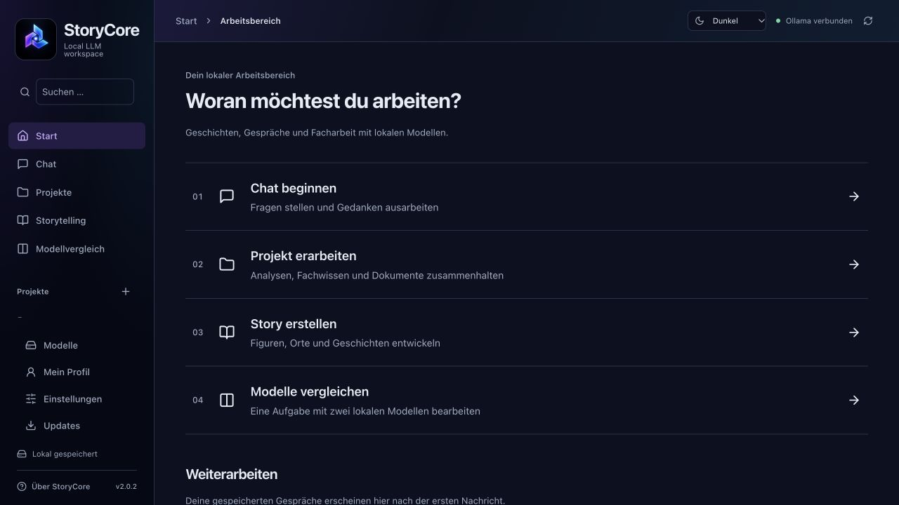

# StoryCore für macOS

Lokale Sprachmodelle mit Ollama nutzen: chatten, Geschichten entwickeln und Modelle vergleichen. Die Vorabversion 2.0.2 ergänzt Projektarbeitsbereiche mit Fachwissen, Dokumenten und einem freiwilligen persönlichen Profil.

Dieses öffentliche Repository enthält **Downloads und Dokumentation**. Der StoryCore-Quellcode bleibt privat. Die App darf kostenlos privat und geschäftlich genutzt werden. Andere Nutzer bitte auf die offiziellen Downloads verweisen; die zentrale Installation in der eigenen Organisation ist erlaubt. [Nutzungsbedingungen](LICENSE.txt).

## Herunterladen

| Kanal | Download | Inhalt |
| --- | --- | --- |
| Stabil | [StoryCore 1.7.1](https://github.com/YorkStack/StoryCore-Releases/releases/tag/v1.7.1) | Bewährter bisheriger Stand: Chat, Story, Modelle und Web-Recherche |
| Vorabversion | [StoryCore 2.0.2](https://github.com/YorkStack/StoryCore-Releases/releases/tag/v2.0.2) | Vier Arbeitsbereiche, Projekte und öffentlicher Updater; freiwillig testen |

Unter **Assets** das **StoryCore_<Version>_Mac-Installer.zip** laden, entpacken und **Install-StoryCore.command** doppelklicken. Die App muss neben der Routine liegen. Alternativ das DMG öffnen. Die automatisch angebotenen „Source code“-Archive enthalten hier nur diese Dokumentation und sind keine App-Installer.

**Apple Silicon (M-Serie), macOS 14 oder neuer.** Kein Node.js, Rust oder Xcode nötig. Die Routine prüft den Mac und Ollama. Falls Ollama fehlt, bietet sie den [offiziellen Download](https://ollama.com/download/mac), das Starten einer vorhandenen Installation oder eine Installation vorerst ohne Ollama an. Modelle anschließend in StoryCore herunterladen.

Die Pakete sind **nicht Apple-notarisiert**. macOS kann eine Freigabe unter Datenschutz & Sicherheit verlangen; verwaltete Macs benötigen eventuell eine IT-Freigabe. Die separate kryptografische Updatesignatur ersetzt keine Apple-Notarisierung. [Installation und Gatekeeper](docs/INSTALLATION-MAC.md).

## Anleitungen

- [Download und Installation](docs/INSTALLATION-MAC.md), mit Ollama und Fehlersuche
- [Erste Schritte](docs/NUTZUNG.md), Modelle, Chat, Regler, Figuren, Orte und Vergleich
- [Projekte und persönliches Profil (2.0.2)](docs/PROJEKTE-2.0.md)
- [Internetrecherche: Tavily, Serper oder Brave](docs/WEB-RECHERCHE.md)
- [Updates und Datensicherung](docs/UPDATES.md)
- [Sicher zu einer älteren Version zurückkehren](docs/ROLLBACK.md)

**Bebilderte PDF-Anleitungen** liegen in jedem Installer und als einzelne Assets beim jeweiligen Release: [1.7.1](https://github.com/YorkStack/StoryCore-Releases/releases/tag/v1.7.1) · [2.0.2](https://github.com/YorkStack/StoryCore-Releases/releases/tag/v2.0.2).

## Daten und Updates

Eine neue Installation beginnt leer, mit neutralen Generierungsprofilen. Keine privaten Geschichten, Charaktere, Zugangsdaten oder Modellgewichte sind enthalten. Eine Neuinstallation auf demselben Mac behält vorhandene lokale Daten. Die Modellliste kommt aus der verbundenen Ollama-Installation; Modelle sind separat auf dem Rechner gespeichert.

Ab 2.0.2: **Updates** prüft höchstens täglich, manuelles Prüfen bleibt möglich. Ein GitHub-Konto ist nicht nötig. Standardmäßig nur stabile Versionen; Vorabversionen ausdrücklich freigeben. Installation erst nach Bestätigung, mit Signaturprüfung und geprüfter Sicherung der Datenordner und bisherigen App. Nicht unterstützte Formatänderungen werden blockiert. Von 1.7.1 oder den privaten Entwicklungsbuilds einmal den neuen ZIP-Installer verwenden.

Standard-Datenordner: `~/Library/Application Support/Still Workbench/`. Eigene Speicherorte sind möglich. Diese Daten gehören nicht in dieses Repository. Ein Downgrade-Assistent ist noch nicht enthalten; eine ältere App darf nicht ungeprüft mit einem neueren Datenbestand arbeiten.

## Transparenz und Lizenzen

[Datenschutz und Sicherheitsgrenzen](SECURITY.md) · [Drittanbieter-Hinweise](THIRD-PARTY-NOTICES.txt). Jedes Release enthält eine **SBOM.json**, Prüfsummen sowie **third-party-sources.zip** mit unveränderten MPL-Komponenten. Die Bestandsliste enthält auch Build-Abhängigkeiten und ist kein Sicherheitszertifikat. Drittanbieter-Lizenzen bleiben uneingeschränkt gültig. Ollama, Modellgewichte und Suchdienste unterliegen eigenen Bedingungen.

Stand: 7. Oktober 2026.
