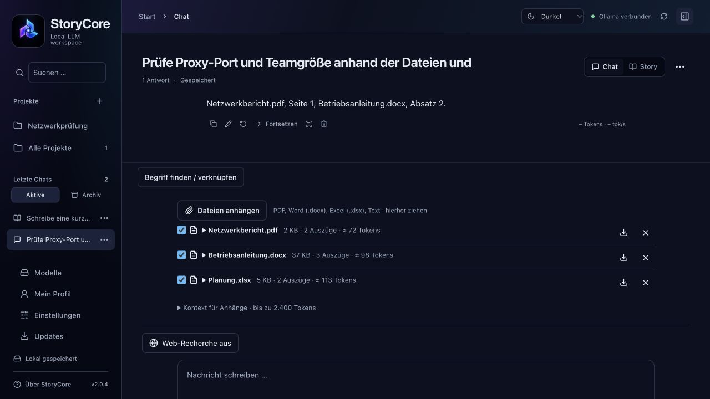

# StoryCore nutzen

Stand: **2.0.4 Vorabversion · 7. Oktober 2026**. [Bebilderte PDF-Anleitung (9 Seiten)](https://github.com/YorkStack/StoryCore-Releases/releases/download/v2.0.4/StoryCore-Erste-Schritte.pdf) · [Installation](INSTALLATION-MAC.md).

## Startseite und neue Navigation

Die Startseite bietet **Chat beginnen → Projekt erarbeiten → Story erstellen → Modelle vergleichen**. **Start** in Kopfzeile oder Seitenleiste führt zurück ins Hauptmenü. Links liegen die vier Arbeitsbereiche, deine Projekte und letzte Chats; unten **Modelle**, **Mein Profil**, **Einstellungen** und **Updates**. Die Suche filtert Gespräche und Projekte. Unter **Storytelling** sind Charaktere, Personas und Lorebooks zusammengefasst. Die rechte Einstellungsleiste erscheint beim Schreiben und Vergleichen.

## Modell auswählen und starten

1. Ollama öffnen, dann StoryCore. Oben sollte **Ollama verbunden** stehen.
2. Unter **Modelle** einen Modellnamen oder kopierten Ollama-Befehl einfügen und **Herunterladen** starten. Über die Ollama-Bibliothek oder den Hugging-Face-GGUF-Katalog passende Textmodelle suchen.
3. Chip und RAM sowie die grobe Speicherprognose beachten. GGUF-Format allein garantiert keine Ollama-Kompatibilität. Embeddings/Spracherkennung sind Katalogfilter; ihre Inferenz ist in StoryCore noch nicht implementiert.
4. Beim installierten Modell **Verwenden** wählen, dann **Zurück zum Schreiben**. **In Speicher laden** ist optional: beim ersten Senden lädt Ollama das Modell bei Bedarf.

**Herunterladen** belegt Festplatte; **Aus Speicher entladen** gibt RAM frei und behält die Modelldateien. **Von Festplatte löschen** entfernt das Modell aus Ollama und der Liste und betrifft auch andere Apps mit derselben Ollama-Installation.

## Chat oder Geschichte

Auf der Startseite **Chat beginnen** oder **Story erstellen** wählen. Nachricht eingeben, mit Enter oder Pfeil senden; Shift+Enter erzeugt eine neue Zeile. Im Chat spricht die gewählte Figur, ohne Charakter ein Assistent. Story erzeugt Prosa mit Handlung und Figurendialog.

Während der Ausgabe kannst du nach oben scrollen. **Zur neuesten Ausgabe** aktiviert das Mitlaufen wieder. **STOP** beendet die Ausgabe und erhält den bisher erzeugten Teil. Chats über den Titel oder das sichtbare **…**-Menü umbenennen, archivieren oder nach Bestätigung löschen. Ein neuer Entwurf erscheint erst nach der ersten Nachricht in der Liste.

## Einstellungen und Profile

| Regler | Bedeutung |
| --- | --- |
| Temperatur | Mehr oder weniger Zufall bei der Tokenauswahl; niedriger garantiert keine richtigen Fakten. |
| Top P | Beschränkt Kandidaten auf eine kumulierte Wahrscheinlichkeit, z. B. 0,9. |
| Top K | Beschränkt die Anzahl der Kandidaten, z. B. 40. |
| Wiederholungsstrafe | 1 ist neutral; etwas höher bremst Wiederholungen, zu hoch kann Sprache verfälschen. |
| Kontextfenster | Gesamtplatz für Anweisungen, Karten, Lore, Quellen, Verlauf und Antwortreserve. Größer benötigt mehr RAM. |
| Max. Ausgabetokens | Obergrenze je Antwort. Eine größere Reserve lässt weniger Platz für Eingaben. |

Zunächst Standardwerte verwenden und nur einen Regler ändern. **Preset speichern unter** sichert die Kombination, **Preset laden** stellt sie wieder her. Diese Regler ändern keine trainierten Modellgewichte. Lokale OpenAI-kompatible Server unterstützen nicht alle Ollama-Optionen; siehe [Kontext und Verwaltung](CONTEXT.md).

## Charakter, Persona, Orte und Lore

Ein **Charakter** beschreibt die Modellrolle, eine **Persona** deine Rolle. Unter **Storytelling → Charaktere → Neu** Name, Eigenschaften, Hintergrund und optional Aussehen ausfüllen. Der kurze Charakterkern bündelt die wichtigsten Fakten und ersetzt, sofern ausgefüllt, die langen Beschreibungsfelder im Prompt. Die **LLM-Schreibhilfe** erzeugt mit dem ausgewählten Modell einen Vorschlag: prüfen, übernehmen und die Karte speichern. **Details** öffnet die Bearbeitung später erneut.

Ein **Lorebook** ist eine Sammlung: beispielsweise ein Buch für eine Welt und darin je ein Eintrag für Ort, Firma, Gegenstand oder Nebenfigur. Ein Buch mit nur einem Ort ist ebenfalls möglich. **Storytelling → Lorebooks → Neu → Eintrag hinzufügen**: Titel, Typ, Schlüsselwörter, Kurzfassung und Details ergänzen, aktivieren und speichern. Rechts im Chat das Buch auswählen und unter **Aktuelle Szene** den aktuellen Ort setzen. Beim Ortswechsel aktualisieren.

Charaktere und Lore über **Verknüpfungen** verbinden. **Einstellungen → Kontext & Budgets** begrenzt geladenes Wissen und Nachladeebenen. Ein Buch wird nicht pauschal vollständig geladen. Markierte Begriffe öffnen den Eintrag; **Verwenden**, **Weglassen** und **Automatisch** steuern dessen Verwendung pro Chat, Story oder Vergleich. Im Projektwissen gilt 10 MB je Datei; dort gibt es nicht das gemeinsame Sechs-Dateien-Limit. Geheimnisse benötigen eine zusätzliche Freigabe. Der **Prompt Inspector** zeigt geladenes Wissen mit Gründen und Token-Schätzung.

## Internetrecherche einrichten und verwenden

1. **Einstellungen → Web-Recherche** öffnen. Tavily, Serper oder Brave wählen.
2. Beim Anbieter ein Konto erstellen, API-Schlüssel kopieren und im zugehörigen Feld eintragen. Die Registrierungslinks und kurzen Kontoanleitungen stehen direkt in der App; ausführlich unter [Web-Recherche](WEB-RECHERCHE.md).
3. **Web-Recherche erlauben** aktivieren und **Einstellungen speichern**. Jeder Anbieter behält einen getrennten Schlüssel.
4. Im Chat, in Stories, Projektgesprächen oder im Modellvergleich **Web-Recherche an** einschalten. Eigene Suchbegriffe eingeben und **Im Web suchen** klicken.
5. Treffer aufklappen und prüfen. Erst danach die eigentliche Frage senden oder den Vergleich starten.

Beispiel: Suchbegriffe `Forward Proxy Reverse Proxy Unterschied`; Frage `Erkläre beide anhand der Quellen, belege Aussagen mit [W1], [W2] und benenne fehlende Belege.` Für zeitabhängige Aktienkurse müssen Börse, Währung und Kurszeitpunkt aus den Quellen hervorgehen; Suchauszüge sind kein Echtzeit-Kursfeed.

Nur die Suchbegriffe gehen an den Suchdienst, nicht automatisch private Karten oder Chatverläufe. Die zurückgegebenen Auszüge gehen mit der Frage an das gewählte lokale Modell. Standardmäßig maximal vier Quellen und 1.200 geschätzte Tokens. Kein Container, keine Browser-Engine, kein automatischer Anbieterwechsel und keine selbstständigen Folgeabrufe.

Nach Sendebeginn ist die Recherche wieder ausgeschaltet. Ohne Recherche arbeitet das Modell mit vorhandenem Wissen und lokalem Kontext. Bei fehlendem Schlüssel, ausgeschöpftem Kontingent oder Netzwerkfehlern erscheint eine Fehlermeldung. Schlüssel und Verbrauch im Anbieter-Dashboard prüfen. Nach 30 Minuten oder geänderten App-Einstellungen erneut suchen.

Tavily-/Serper-Auszüge bleiben mit der Antwort gespeichert. Bei Brave werden Quellen und vollständige Promptkopien ohne bestätigte vertragliche Speicherrechte nicht gespeichert; die Modellantwort bleibt. Schlüssel befinden sich nur lokal in `settings.json` (0600), nicht im macOS-Schlüsselbund und nicht in Projekt-Exporten. Kontingente und mögliche Kosten gelten je Anbieter. Ein erfolgreicher Live-Test mit produktiven Tavily-/Serper-Schlüsseln steht noch aus; die automatisierten Anbindungstests verwenden simulierte Antworten.

## Zwei Modelle vergleichen

Beide Textmodelle installieren, **Modellvergleich** öffnen und unterschiedliche Modelle A/B wählen. Gemeinsamen Test-Prompt eingeben, **Prompt prüfen**, dann **Vergleich starten**. StoryCore führt die Modelle nacheinander mit denselben vorbereiteten Nachrichten, Einstellungen, Karten, Lore und gegebenenfalls Recherchequellen aus. Quellen vor dem Vergleich einmal suchen; keine getrennten Suchläufe je Modell.

Bewerte zuerst Vorgabentreue, Faktentreue, Vollständigkeit und Verständlichkeit. Prüfe Quellenverweise auf Übereinstimmung mit den Auszügen. Danach Laufzeit, Ausgabetokens und Tokens/s vergleichen. Eine schnelle Antwort ist nicht automatisch besser. Unterschiedliche Tokenizer, Vorlagen und Antwortlängen begrenzen direkte Leistungsvergleiche. Mehrfach mit verschiedenen Aufgaben wiederholen. **Export** sichert Ergebnisse; **Übernehmen** macht daraus einen Chat.

## Kontext komprimieren und sichern

Der Tacho schätzt den nächsten Request einschließlich Antwortreserve. Ab 65 % wird **Kontext komprimieren** angeboten, ab 80 % dringlicher. Das ausgewählte Modell verdichtet ältere Nachrichten; die fertige Kurzfassung wird automatisch gespeichert und aktiviert. **Kontextspeicher aktiv** bestätigt den Erfolg. Originaltext und mindestens vier jüngste Nachrichten bleiben erhalten.

Unter **Gespeicherte Zusammenfassung ansehen** Namen, Beziehungen und offene Handlungen prüfen. Zusammenfassungen können Details verlieren. Bei Änderungen an schon verdichteten Nachrichten wird der Speicher ungültig; erneut komprimieren. Komprimierung führt keine neue Internetsuche aus. Für aktuelle Fakten gezielt erneut recherchieren. [Details zum Kontextspeicher](MEMORY.md).

Chats, Karten und Projekte exportieren oder den gesamten lokalen Datenordner separat sichern. Der ZIP-Installer sichert die App; der integrierte Updater sichert zusätzlich alle konfigurierten Datenordner. [Updates und Wiederherstellung](UPDATES.md). Standard auf dem Mac: `~/Library/Application Support/Still Workbench/`; eigene Speicherorte stehen unter Einstellungen. Modelle liegen getrennt bei Ollama. Das Installationspaket enthält keine persönlichen Geschichten, Schlüssel oder Modellgewichte.

## Dateien per Drag-and-drop

Öffne den gewünschten Arbeitsbereich und ziehe Dateien aus dem Finder hinein. Alternativ **Dateien anhängen** im Chat/Story/Vergleich oder **Dateien hinzufügen** im Projekt verwenden. Während der Verarbeitung sind Wechsel und Generierung gesperrt. Lege die Dateien in den gerade sichtbaren Arbeitsbereich, nicht auf ein anderes App-Fenster. Unterstützt werden PDF mit Text, Word-Dokumente (.docx), Excel-Arbeitsmappen (.xlsx), TXT, Markdown, CSV und TSV. Danach stelle deine Frage zu den Dokumenten. Der bisherige Import heißt jetzt **Chat-JSON importieren** und dient weiterhin gespeicherten Gesprächsdateien.

| Ablage | Gültigkeit und Speicherung |
| --- | --- |
| Chat oder Story | Anhänge gehören zu diesem Gespräch. Mit der ersten Nachricht wird der Chat gespeichert; vorher ist es ein ungespeicherter Entwurf. |
| Projektgespräch | Anhänge gehören nur zu diesem Gespräch. Sie werden nicht automatisch Projektwissen. |
| Geöffnetes Projekt, auch außerhalb des Reiters Wissen | Dateien werden im **Wissen** gespeichert und stehen allen Gesprächen dieses Projekts zur Verfügung. |
| Modellvergleich | Gemeinsame Anhänge für alle gewählten Modelle. Beim Start des Vergleichs werden Originale und verwendete Auszüge gespeichert; kein zusätzlicher Chat entsteht. |

- Bis zu sechs Dateien, zusammen 10 MB und eine Million ausgelesene Textzeichen pro Chat, Story oder Vergleich. Im Projektwissen gilt 10 MB je Datei; dort gibt es nicht das gemeinsame Sechs-Dateien-Limit.
- Klicke auf den Dateinamen, um den ausgelesenen Text zu prüfen. Bei Excel werden Tabellenblätter, Zeilen und Zelladressen übernommen. Formeln werden nicht ausgeführt; vorhandene gespeicherte Ergebnisse werden mit übernommen. Zahlenformate stehen neben den Rohwerten.
- Mit dem Häkchen schaltest du einen Anhang für künftige Anfragen aus oder ein. Mit **×** entfernst du ihn aus dem aktuellen Chat oder Vergleich; deine Quelldatei bleibt erhalten. Bereits erzeugte Antworten und gespeicherte Prompts können frühere Auszüge weiterhin enthalten.
- Unter **Kontext für Anhänge** stellst du das gemeinsame Budget ein (standardmäßig 2.400 geschätzte Tokens). Die App sucht anhand deiner Frage passende Textauszüge und berücksichtigt den verfügbaren Kontextplatz. Eine vollständige Auswertung großer Dateien ist dadurch nicht garantiert; frage gezielt nach Seite, Blatt oder Begriff.
- Die Originale bleiben lokal in der Chat- oder Vergleichsdatei und sind beim Sichern und JSON-Export enthalten. Projektwissen einschließlich Originalen ist im Projekt-ZIP enthalten. Beim Übernehmen eines Vergleichsergebnisses in einen Chat bleiben seine Anhänge erhalten. Teile einen Chat-Export daher nur, wenn du auch die Anhänge weitergeben möchtest. An das gewählte Modell gehen ausschließlich die ausgewählten Textauszüge.

Gescannte PDFs benötigen vorher eine Texterkennung (OCR). Alte .doc- und .xls-Dateien bitte in Word/Excel als .docx beziehungsweise .xlsx speichern. Bilder, Diagramme, Makros und eingebettete Objekte werden nicht interpretiert.

## Projekte, Profil und größere Dokumente

**Projekt erarbeiten** öffnet einen eigenen Arbeitsbereich mit **Übersicht, Gespräche, Wissen und Ergebnisse**. In der Übersicht Ziel, Expertenrolle, Profilfreigabe und Projektbudget setzen. Unter Wissen gemeinsame Handbücher hinzufügen. Mit Neues Gespräch einzelne Aufgaben bearbeiten. Erkenntnisse erst prüfen und bestätigen, bevor sie in das Projektgedächtnis übernommen werden. Ergebnisse werden als Markdown-Dokumente versioniert; Export als MD/TXT. Die gesamten Verläufe anderer Gespräche werden nicht automatisch beigefügt. [Vollständiger Projektablauf](PROJEKTE-2.0.md).

**Mein Profil** enthält optionale persönliche Antwortvorlieben. Es ist getrennt von fiktiven Personas und gilt nur bei Freigabe für normale Chats bzw. Projekte. Keine automatische Ableitung aus Gesprächen. Stories und Charakter-/Persona-Chats verwenden es nicht.

## Dateien im Modellvergleich

Im Vergleich dieselben Dateien wie im Chat anhängen oder hineinziehen. Vor dem Start Originale und Textvorschau prüfen. **Kontext für Anhänge** setzt das gemeinsame Budget. Mit **Prompt prüfen** kontrollierst du die tatsächlich ausgewählten Auszüge. Der eingefrorene Request einschließlich Projektwissen und Anhängen ist für alle Vergleichsmodelle gleich; die tatsächlichen Tokenzahlen können wegen unterschiedlicher Tokenizer abweichen.

Unter **Gespeicherte Vergleiche** werden Prompt, Modellwahl und Anhänge wiederhergestellt. Noch nicht gestartete Vergleichsentwürfe sind ungespeichert; beim Wechsel wird gewarnt. Richtigkeit, Vollständigkeit und Nachvollziehbarkeit können selbst mit 1–5 bewertet und je Ergebnis gespeichert werden. **Übernehmen** erstellt einen Chat mit den Originalanhängen. Dokumentauszüge werden dabei nicht als zusätzliche sichtbare Nutzernachrichten eingefügt.
