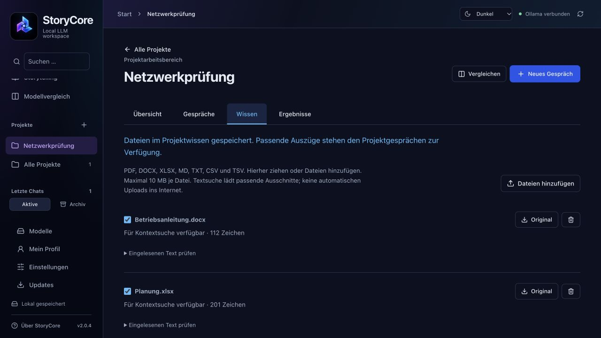

# Projekte und persönlicher Kontext in StoryCore 2.0

Vorabversion 2.0.4 vom 7. Oktober 2026. [Zur Dokumentationsübersicht](../README.md).

## Start und Navigation

Die Startseite bietet **Chat beginnen**, **Projekt erarbeiten**, **Story erstellen** und **Modelle vergleichen**. Darunter liegt „Weiterarbeiten“. Die Seitenleiste zeigt Projekte und Gespräche sowie unten Modelle, Mein Profil und Einstellungen. Ihre Suche filtert Projektnamen und Gesprächstitel. Unter Storytelling liegen Charaktere, Personas und Lorebooks. Die rechte Einstellungsleiste ist beim Schreiben und Vergleichen verfügbar.

Eine frische Installation enthält keine persönlichen Profile, Figuren oder Projektdokumente. Bestehende Daten werden erhalten. Ein leerer neuer Chat wird erst nach der ersten Nachricht gespeichert.

## Ein Projekt anlegen

1. **Projekt erarbeiten** wählen und einen Namen vergeben.
2. Unter **Übersicht** Ziel und Expertenrolle eintragen, beispielsweise „Du bist Netzwerkingenieur. Trenne Beobachtungen, Hypothesen und bestätigte Ursachen.“
3. Optional das persönliche Profil freigeben und das gemeinsame Projektkontextbudget einstellen. Standard: 2.400 geschätzte Tokens.
4. **Projekt speichern**. Nicht gespeicherte Änderungen werden beim Bereichswechsel angekündigt.
5. **Neues Gespräch** beginnen. Weitere Gespräche liegen im Reiter Gespräche und teilen nur das ausdrücklich gespeicherte Projektwissen. Die gesamten Verläufe anderer Gespräche werden nicht automatisch mitgesendet.

Ein vorhandenes älteres Story-Projekt kann über Projekt speichern zusätzlich einen Arbeitsbereich erhalten. Seine bisherigen Figuren, Lore-Verweise und Story-Gespräche bleiben erhalten. Neue Arbeitsgespräche beginnen ohne Story-Rolle.

## Mein Profil

Name, Hintergrund/Fachkenntnisse und Antwortvorlieben werden lokal unter **Mein Profil** gespeichert. Das Profil ist zunächst ausgeschaltet. Ein aktiviertes Profil gilt für normale Chats; Projekte benötigen eine zusätzliche Freigabe in ihrer Übersicht. Der einzelne Chat kann die Verwendung weiter ausschalten. Stories, Charakter-/Persona-Chats und Gespräche mit Lore verwenden es nicht.

Das Profil lässt sich ändern oder vollständig leeren. Es wird nicht automatisch aus Gesprächen abgeleitet und nicht in Projektarchive aufgenommen. Bereits gespeicherte Prompt-Snapshots dokumentieren frühere Requests und können die damals verwendeten Profilangaben weiterhin enthalten. Ein Export solcher Chats enthält diese historischen Snapshots. Vor dem Weitergeben prüfen.

## Wissen hinzufügen

Dateien in das geöffnete Projekt ziehen oder **Wissen → Dateien hinzufügen** wählen. Die Ablage funktioniert auch aus Übersicht, Gespräche und Ergebnisse und öffnet anschließend Wissen. Unterstützt werden MD, UTF-8-TXT, PDF, DOCX, XLSX, CSV und TSV. Maximal 10 MB Originaldatei, 1 Mio. Zeichen und 500 Textabschnitte. Alte .doc-Dateien bitte zuerst als DOCX speichern.

- PDF: Text mit Seitenangaben. Gescannten Seiten ohne Textschicht fehlt OCR. Bei teilweise gescannten PDFs kann nur vorhandener Text eingelesen werden; den Text über „Eingelesenen Text prüfen“ kontrollieren.
- DOCX: Text des Hauptdokuments mit Absatzangaben. Bilder, Diagramme, Kopf-/Fußzeilen und Kommentare werden nicht als Fachwissen interpretiert. Layout und Tabellenstruktur sind im Textauszug nicht originalgetreu.
- XLSX: Tabellenblatt, Zeilen, Zelladressen und gespeicherte Zellwerte. Keine Formelberechnung; keine Makros, Bilder oder Diagramme. Alte XLS-Dateien vorher als XLSX speichern.
- MD/TXT/CSV/TSV: Text als Wissensgrundlage; Trennzeichen bleiben erkennbar.

Die Originaldatei bleibt lokal gespeichert und ist über **Original** exportierbar. Das Häkchen schließt eine Datei in die Kontextsuche ein oder daraus aus. Entfernen löscht sie aus dem Projekt; vorhandene Antwort-Snapshots enthalten weiterhin ihre früher verwendeten Auszüge.

Die Suche arbeitet lokal mit Wörtern aus der aktuellen und den beiden letzten Nutzerfragen. Passende Abschnitte werden nach Relevanz ausgewählt, höchstens sechs Auszüge. Kein Embedding-Modell erforderlich; semantische Vektorsuche ist noch nicht implementiert. Bei Fragen wie „Was steht darin?“ besser Dateiname und Fachbegriffe nennen. Nicht alle Dokumente werden vollständig in jeden Request kopiert.

Rechts unter **Projektkontext** sowie direkt an Antworten siehst du verwendete Quellen und Auszüge. Der Prompt Inspector zeigt den vollständigen Request. Tokenzahlen sind Schätzungen, keine exakten Tokenizer-Messungen. Ist der Verlauf zu voll, bleibt weniger Platz für Projektwissen; die bestehende Komprimierung hilft dann.

## Projektgedächtnis

Eine Modellantwort kann über **Erkenntnis prüfen / merken** in die Übersicht übernommen werden. Dort lässt sie sich bearbeiten oder mit **Mit LLM verdichten** kürzen. Der LLM-Vorschlag wird nicht automatisch als bestätigtes Wissen gespeichert.

Text und Herkunft prüfen, **Bestätigt vormerken** und anschließend **Projekt speichern**. Eine Erinnerung hat maximal 2.000 Zeichen. Unsicherheit und offene Fragen erhalten: Eine Hypothese ist keine bestätigte Ursache. Erinnerungen lassen sich entfernen; anschließend erneut speichern.

Das Projektgedächtnis ist getrennt vom Kontextspeicher eines einzelnen Gesprächs. Letzterer komprimiert ältere Nachrichten und erhält den Originalverlauf.

## Ergebnisse und größere Dokumente

**Als Ergebnis bearbeiten** übernimmt eine Projektantwort in den Reiter Ergebnisse. Alternativ ein leeres Dokument anlegen. Der Editor verwendet Markdown. Jede Speicherung legt eine neue Version an, bis zu 50 Versionen je Dokument und 200.000 Zeichen je Version. Ältere Versionen lassen sich in den Editor übernehmen und als weitere Version speichern.

**Mit LLM bearbeiten** bereitet ein neues Projektgespräch vor und fügt den aktuellen Dokumenttext in dessen Eingabe ein. Es sendet nicht automatisch. Vor dem Senden kann der Text auf einen Abschnitt reduziert werden. Sehr lange Dokumente abschnittsweise bearbeiten, damit sie ins Modellfenster passen. Die Ausgabe über „Als Ergebnis bearbeiten“ in ein Ergebnis übernehmen; bestehende Dokumente werden nicht automatisch überschrieben oder zusammengeführt.

Export: Markdown oder TXT; sämtliche Versionen sind zusätzlich im Projektarchiv enthalten. DOCX/PDF-Export und visuelle Änderungsvergleiche sind noch nicht implementiert.

## Zwei Modelle vergleichen

Im Projekt **Vergleichen** wählen, zwei lokale Modelle und einen gemeinsamen Test-Prompt festlegen. Projektrolle, Profilfreigabe, bestätigte Erinnerungen und ausgewählte Dokumentauszüge werden einmal zusammengestellt und für beide Modelle eingefroren. Ausführung erfolgt nacheinander, damit sich die Modelle nicht gleichzeitig den Arbeitsspeicher teilen müssen.

Neben Laufzeit und Tokens lassen sich Richtigkeit, Vollständigkeit und Nachvollziehbarkeit selbst mit 1–5 bewerten. **Speichern** sichert das jeweilige Ergebnis einschließlich Bewertung. Eine Zahl ersetzt keine fachliche Prüfung. Die App vergibt keine automatische Qualitätsnote.

## Sicherung, Weitergabe und Grenzen

Unter **Übersicht → Projekt verwalten und exportieren** liegen Archivieren, Wiederherstellen, ZIP-Export und Löschen. Projektarchive enthalten zugeordnete Gespräche, Story-Ressourcen, Wissen inklusive Originaldateien und Ergebnisversionen. Maximal 50 MB entpacktes Projektarchiv. Löschen eines noch in Gesprächen verwendeten Projekts wird verhindert; zuerst diese Gespräche löschen oder ihre Zuordnung entfernen.

Profile, Quelldateien und Antworten bleiben lokal. Nur ausdrücklich gestartete Internetrecherche übermittelt die angezeigten Suchbegriffe an den gewählten Anbieter. Lokale Dateien werden dadurch nicht automatisch hochgeladen. Auch lokale Modelle können Quellen falsch verstehen oder Zusammenfassungen unvollständig erstellen. Die Quellenanzeige macht die tatsächlichen Auszüge prüfbar.

## Anhänge im Gespräch oder Vergleich

**Dateien anhängen** im Projektgespräch gilt nur dort. Gemeinsame Grundlagen stattdessen ins **Projektwissen** ziehen. Im Projektvergleich können zusätzliche Anhänge aufgenommen werden; beide Modelle erhalten dieselben ausgewählten Auszüge. Pro Gespräch bzw. Vergleich maximal sechs Dateien, zusammen 10 MB. [Formate und Grenzen](NUTZUNG.md#dateien-per-drag-and-drop).

**Updates** links unten prüft täglich oder manuell und installiert nach Datensicherung. [Update-Anleitung](UPDATES.md).
