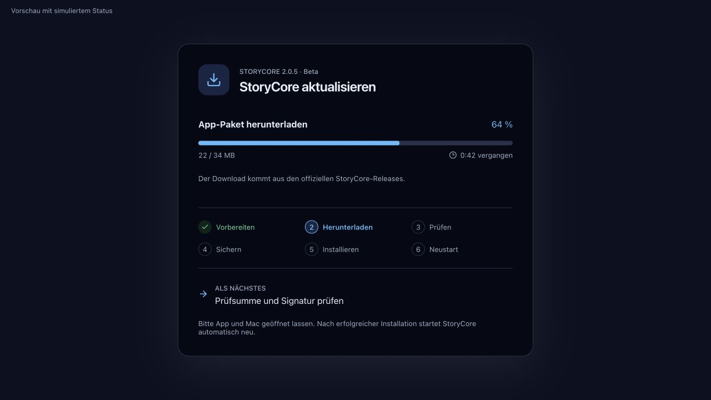

# StoryCore aktualisieren

Stand: 2.0.7 stabil, 7. Oktober 2026. Der öffentliche Update-Kanal ist ab 2.0.2 enthalten. Ältere Apps benötigen einmal den normalen Installer aus dem öffentlichen Download-Repository.

## Updates unter /Applications ab 2.0.6 Beta

`/Applications` ist ein unterstützter normaler Installationsort. StoryCore aktualisiert die App dort, ohne sie in den Benutzerordner zu verschieben. Sind Administratorrechte erforderlich, erscheint der macOS-Systemdialog. Zugangsdaten werden ausschließlich dort eingegeben; StoryCore speichert sie nicht. Der Download und die Datensicherung laufen ohne erhöhte Rechte. Nur der abschließende App-Austausch verwendet die Freigabe. Kein dauerhaft installierter privilegierter Dienst.

Das signierte Paket wird vor dem Austausch in einem separaten Verzeichnis geprüft. Die bisherige App bleibt bis zur Kontrolle der neuen Installation erhalten. Bei Fehlern wird sie mit denselben Rechten zurückgestellt; bei abgebrochener Freigabe bleibt sie unverändert. Ein echtes schreibgeschütztes DMG wird separat erkannt und kann auch mit Administratorrechten nicht aktualisiert werden.

**Einmaliger Übergang:** 2.0.2 bis 2.0.5 brechen bei bestimmten Installationsrechten schon vor dem Download ab. Dieser alte Programmcode lässt sich nicht durch neue Release-Metadaten reparieren. Betroffene Nutzer müssen einmal den [reparierten Installer 2.0.7](https://github.com/YorkStack/StoryCore-Releases/releases/tag/v2.0.7) ausführen. Er aktualisiert eine vorhandene App unter `/Applications` mit macOS-Freigabe. Danach ist dieser Weg direkt in der App eingebaut. Chats und Einstellungen werden nicht gelöscht; der separate Installer sichert die App, Nutzerdaten bitte zusätzlich sichern. Ohne verfügbaren Administrator kann eine geschützte Installation weiterhin nur durch die IT geändert werden.

**Release-Status:** 2.0.7 ist vom Eigentümer als stabil freigegeben und wird im Standardkanal angeboten. Der native Administrator-Dialog ist implementiert; ein kompletter Test mit interaktiver Administratorfreigabe steht noch aus. Unprivilegierter Austausch, Fehler-Rücksetzung, Archiv-Prüfung und Dialogskript-Kompilierung sind automatisiert geprüft.

## Für Benutzer

Links unten **Updates** öffnen. Die App fragt beim Start nach der neuesten stabilen GitHub-Veröffentlichung und speichert den Zeitpunkt. Auch nach einem Neustart wird innerhalb von 24 Stunden nicht erneut automatisch angefragt. Bei dauerhaft geöffneter App erfolgt die nächste Prüfung nach 24 Stunden. Das gilt auch nach Netzwerkfehlern. **Jetzt prüfen** startet eine ausdrückliche zusätzliche Prüfung. Die Automatik lässt sich abschalten.

Die Prüfung lädt nur Release-Metadaten. Weder Chattexte noch Dokumente, Profil oder Modellnamen werden übertragen. GitHub erhält die üblichen Verbindungsdaten und gegebenenfalls deinen Zugangstoken. Unveröffentlichte Commits und Entwicklungszweige werden nicht installiert. Vorabversionen werden nur nach bewusster Freigabe angeboten.

### Öffentliche Downloads und Vorabversionen

[YorkStack/StoryCore-Releases](https://github.com/YorkStack/StoryCore-Releases) ist öffentlich. Nutzer brauchen keinen GitHub-Account oder Zugangstoken. Der Quellcode bleibt im getrennten privaten Entwicklungsrepository.

Standardmäßig werden **nur stabile Versionen** angeboten. Unter **Updates → Versionen anbieten → Auch Vorabversionen** lassen sich Vorabversionen ausdrücklich einschalten. Danach **Jetzt prüfen** wählen. Vorabversionen können Fehler enthalten. Zurückschalten auf stabile Versionen ändert nur künftige Angebote und führt keinen Downgrade aus.

Ein optionaler Token kann bei GitHub-API-Limits helfen. Ein ungültiger alter Token sollte unter **Optionaler GitHub-Zugang → Token entfernen** gelöscht werden. Tokens werden lokal mit eingeschränkten Dateirechten, aber nicht verschlüsselt gespeichert und sind in Datensicherungen enthalten. Backups niemals öffentlich weitergeben.

### Grafische Fortschrittsanzeige ab 2.0.5

Die Installation zeigt sechs Schritte, einen Downloadbalken mit echten Prozent- und MB-Werten, die vergangene Zeit und die nächste Aktion. Prüfung, Sicherung und Installation verwenden eine Aktivitätsanzeige ohne erfundene Prozentwerte oder Restzeit. Bei Fehlern bleibt die Meldung sichtbar; es gibt keinen automatischen Neustart. „Zurück zu Updates“ schließt die Meldung, „Erneut versuchen“ startet nach erneuter Bestätigung. Nach einem Fehler während der Wiederherstellung zuerst die genannte Sicherung prüfen.

Beim ersten Update auf 2.0.5 verwendet die ältere App noch ihren bisherigen Bildschirm. Die neue Anzeige gilt für nachfolgende Updates. 2.0.5 bleibt eine ältere Beta; 2.0.7 ist stabil und Latest.



### Installieren

Bei einem verfügbaren Update zeigt die App einen Hinweis. **Update ansehen → Sichern und Update installieren** zeigt Versionshinweise und die angekündigten Datenänderungen. Nach Bestätigung:

1. Laufende Aufgaben und ungespeicherte Eingaben müssen abgeschlossen sein.
2. Das vollständige App-Paket wird heruntergeladen. SHA-256 und Tauri-Updatesignatur einschließlich der signierten Versionsnummer werden geprüft.
3. Schreibzugriffe werden gesperrt. Alle konfigurierten Datenverzeichnisse werden unverändert kopiert und mit Prüfsummen überprüft. Eigene Speicherorte werden berücksichtigt.
4. Die bisherige App wird als geprüftes ZIP gesichert. Erst danach wird das App-Paket ersetzt und StoryCore neu gestartet.

Ollama und dessen heruntergeladene Modelle werden dabei nicht verändert. Aktuell gibt es vollständige App-Updates, keine binären Delta-Patches. Es ist kein Apple-Entwicklerabo für die separate Updatesignatur erforderlich. Diese Signatur ersetzt keine Apple-Notarisierung und hebt Gatekeeper nicht auf.

Die App muss in einem beschreibbaren Anwendungsordner liegen, beispielsweise `~/Applications/StoryCore.app`. Ein schreibgeschütztes DMG kann nicht aktualisiert werden.

## Daten und Wiederherstellung

Gesichert werden der gesamte Hauptdatenordner und alle zusätzlichen konfigurierten Speicherorte: Chats, Stories, Charaktere, Personas, Lorebooks, Presets, Projekte, Vergleiche, Wissensdateien samt Originalen, Ergebnisversionen und persönliches Profil. Bestätigte Projekterinnerungen befinden sich in den Projektdateien. Unbekannte Felder und zusätzliche Dateien werden bytegetreu erhalten.

Standardpfad der Sicherungen:

```text
~/Library/Application Support/Still Workbench.backups/before-<Version>-<Zeitpunkt>-<ID>/
```

Bei einem anderen Hauptdatenordner wird `.backups` an dessen Pfad angehängt. Jeder Sicherungsordner enthält:

- `source-N/`: Originaldateien aus den gesicherten Verzeichnissen.
- `backup.json`: Zuordnung zu den ursprünglichen Dateipfaden, Dateigrößen und SHA-256-Prüfsummen.
- `WIEDERHERSTELLUNG.txt`: Vorgehen zum Wiederherstellen.
- `previous-app.zip`: bisherige App, sobald auch deren Archivierung abgeschlossen ist.

Backups werden nicht automatisch gelöscht. Zum Aufräumen können ältere Sicherungen nach erfolgreicher Kontrolle der neuen App manuell entfernt werden. Für eine Wiederherstellung StoryCore beenden, zunächst den aktuellen Datenstand separat sichern und die Dateien anhand von `backup.json` an ihre ursprünglichen Orte zurückkopieren. Die vorherige App kann aus dem ZIP wiederhergestellt werden. Bei einem erkannten Installationsfehler versucht der Updater dies automatisch; bei einem späteren Startfehler bleibt das ZIP für eine manuelle Wiederherstellung erhalten.

Bei Platzmangel, fehlenden Speicherorten, symbolischen Links innerhalb der Datenverzeichnisse oder einer fehlgeschlagenen Sicherung wird nicht installiert. Quellverzeichnisse mit symbolischen Pfadangaben werden auf ihren tatsächlichen Ort aufgelöst. Backups dürfen keine Datenverzeichnisse überlappen.

### Formatänderungen

`release-data-policy.json` beschreibt die unterstützte Datenformat-Version und Änderungen pro Release. 2.0.2 schreibt bestehende Datensätze nicht um. Es ergänzt nur `.data-format.json` und Update-Einstellungen. Alte Daten ohne Kennung gelten als bestehendes Format 1.

Der Updater akzeptiert derzeit nur Releases, die Format 1 lesen und weiter schreiben und keine Datenlöschung ankündigen. **Andere Formatänderungen werden mit Erklärung blockiert.** Eine zukünftige Migration muss gezielt implementiert und mit bestehenden Daten getestet werden. Eine alte App mit dieser Schutzfunktion verweigert das Öffnen eines unbekannten Datenformats, bevor sie Daten anlegt oder verändert. Ältere Versionen vor 2.0.1 kennen diese Prüfung noch nicht und sollten nicht auf neuere Datenbestände angesetzt werden.

Eine Sicherung schützt nicht vor jedem möglichen Fehler eines neuen Programms. Deshalb bleiben Originaldateien, frühere App und Prüfmanifest erhalten. Es gibt keine automatische Löschung von Nutzerdaten im Updateablauf.

## Releases bauen

Der öffentliche Updateschlüssel steht in `src-tauri/tauri.conf.json`. Der private Schlüssel gehört niemals ins Repository oder App-Paket. Beim lokalen Einrichten wurde er außerhalb des Repositories unter `~/.config/storycore/release-signing.key` abgelegt. Diesen Schlüssel separat sicher sichern; bei Verlust können bestehende Installationen neue Pakete nicht mehr prüfen.

```sh
export TAURI_SIGNING_PRIVATE_KEY="$HOME/.config/storycore/release-signing.key"
export TAURI_SIGNING_PRIVATE_KEY_PASSWORD=""
# package.json/Cargo synchron halten; Datenrichtlinie für genau diese Version prüfen.
npx tauri build --bundles app
npm run updates:manifest
```

Ergebnisse unter `src-tauri/target/release/bundle/macos/`:

- `StoryCore.app.tar.gz`
- `StoryCore.app.tar.gz.sig`
- `storycore-update.json`

Alle drei Dateien gemeinsam im öffentlichen Download-Repository an das passende GitHub-Release `v<Version>` anhängen. Ein Release erst als Entwurf vorbereiten, Assets vollständig hochladen und anschließend veröffentlichen. Der Updater bezieht Release und Assets über die feste GitHub-API, ohne Zugang zum privaten Quellcode. Veröffentliche nicht nur den Commit: Der Updater benötigt diese Release-Dateien.

`npm run desktop:build` erzeugt zusätzlich den normalen Installer samt Dokumentation; dessen bestehende Prüfung verlangt PDF-Anleitungen mit passender Versionsnummer. Die neue Update-Funktion ist unabhängig von dieser PDF-Verpackung. Ohne Release-Schlüssel kann ein Entwickler einen lokalen Build mit deaktiviertem `bundle.createUpdaterArtifacts` erstellen; dieser Build ist kein veröffentlichbares Update.

Native Installation: Tauri-Updater für Signaturprüfung und Paketinstallation; eigene vorgelagerte Sicherung sowie Wiederherstellung bei einem erkannten Installationsfehler. Der interne Download-Endpunkt ist ausschließlich auf `127.0.0.1`, mit dem zufälligen Desktop-Sitzungstoken geschützt und ohne Systemproxy. Externe Downloads verwenden HTTPS. Es gibt keine allgemeinen Updater-Rechte für JavaScript und keine frei wählbaren Update-URLs.

Referenzen: [Tauri-Updater](https://v2.tauri.app/plugin/updater/), [GitHub Release-Assets](https://docs.github.com/en/rest/releases/assets), [Fine-grained Personal Access Tokens](https://docs.github.com/en/authentication/keeping-your-account-and-data-secure/managing-your-personal-access-tokens).

## Datenänderungen in 2.0.4

Optionale Anhänge werden in Chat und Vergleich gespeichert; Projektwissen unterstützt zusätzlich Tabellen. Das Datenformat bleibt 1. Bestehende Daten werden weder migriert noch gelöscht. Originaldateien sind Bestandteil der Datensicherung. Die reguläre Version 2.0.4 enthält Installer, beide neuen PDF-Anleitungen und signierte Update-Artefakte.

## Reguläre Freigabe von 2.0.7

2.0.7 wird im Standardkanal **Nur stabile Versionen** angeboten. **Jetzt prüfen** umgeht die tägliche Wartefrist. Ein Vorabversions-Opt-in ist nicht erforderlich. GitHubs Latest zeigt ebenfalls auf 2.0.7. Die öffentliche Versionsübersicht beginnt bei 2.0.2. App-Paket und Datenformat bleiben bei dieser Freigabe unverändert.

## Freigaberegel

Neue Releases werden als Beta veröffentlicht. Nur die ausdrückliche Freigabe des Eigentümers macht sie stabil und für den normalen Update-Kanal verfügbar. Standard bleibt **Nur stabile Versionen**. **Auch Vorabversionen** schaltet Betas ausdrücklich hinzu. Derzeit: **2.0.7 aktuell stabil**, **2.0.2 stabiler Vorgänger** (erster öffentlicher Updater). Interne 2.0.1 verwendete noch das private Repository. Ältere Versionen werden nicht automatisch als Downgrade installiert.
